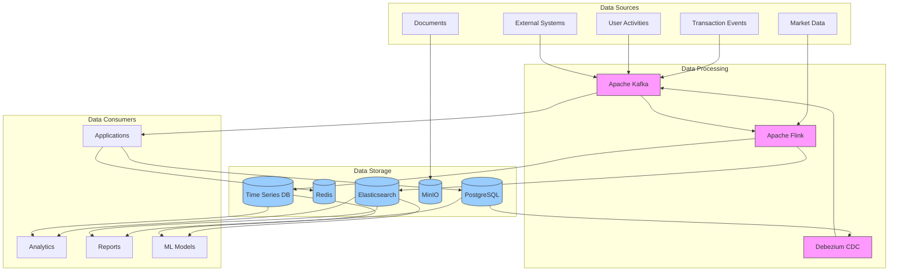
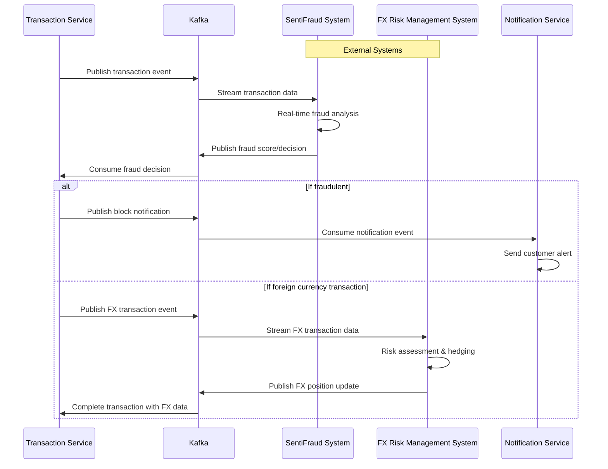
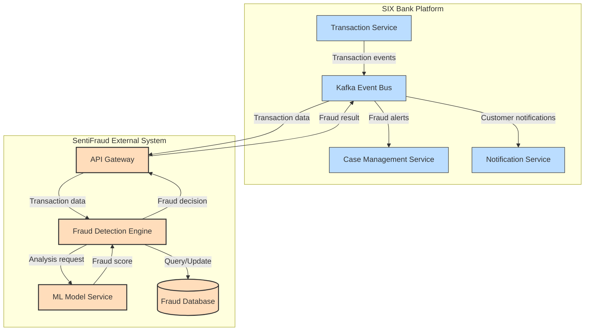
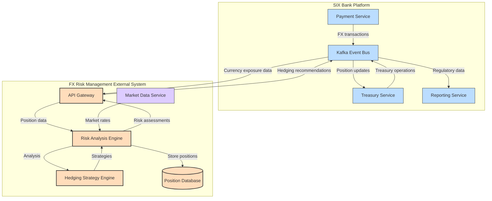

# SIX Bank Platform - Technical Architecture Design

## Executive Summary

The SIX Bank Platform is an enterprise-grade banking solution built on a cloud-native microservices architecture. This document outlines the comprehensive technical architecture, highlighting the integration of SentiFraud and FX Risk Management systems as core components. The platform is designed for high availability, scalability, security, and compliance with international banking regulations.

## System Architecture Overview

### Architectural Principles

1. **Domain-Driven Design**: Services are organized around business domains rather than technical functions
2. **Event-Driven Architecture**: Asynchronous communication between services using event streams
3. **CQRS Pattern**: Separation of command and query responsibilities for optimal performance
4. **High Availability**: All components designed for redundancy and fault tolerance
5. **Zero Trust Security**: Defense-in-depth approach with the principle of least privilege
6. **Observability First**: Comprehensive monitoring, logging, and tracing built-in from the start
7. **API-First Design**: All functionality exposed through well-defined APIs

### High-Level Architecture Diagram

Below is a Mermaid diagram showing the high-level architecture of the SIX Bank Platform, including the integration with SentiFraud and FX Risk Management as external systems, and support for Open Banking:

```mermaid
flowchart TB
    subgraph "Client Layer"
        web["Web Portal"]
        mobile["Mobile Apps"]
        partners["Partner APIs"]
        admin["Admin Dashboards"]
        regulators["Regulatory APIs"]
        openbanking["Open Banking TPPs"]
    end

    subgraph "API Gateway Layer"
        kong["Kong API Gateway"]
    end

    subgraph "Domain Services Layer"
        core["Core Banking Domain"]
        customer["Customer Experience Domain"]
        risk["Risk & Compliance Domain"]
        data["Data & Analytics Domain"]
        integration["Integration & Support Domain"]
        openbank["Open Banking Domain"]
    end

    subgraph "External Systems"
        sentiFraud["SentiFraud System"]
        fxRisk["FX Risk Management System"]
        thirdParty["Third-Party Services"]
    end

    subgraph "Event Streaming Layer"
        kafka["Apache Kafka"]
        debezium["Debezium CDC"]
    end

    subgraph "Data Storage Layer"
        postgres["PostgreSQL"]
        redis["Redis"]
        elastic["Elasticsearch"]
        minio["MinIO"]
        tsdb["Time Series DB"]
    end

    subgraph "Processing Layer"
        flink["Apache Flink"]
    end

    subgraph "Monitoring Layer"
        prom["Prometheus"]
        grafana["Grafana"]
        zipkin["Zipkin"]
    end

    %% Client connections to API Gateway
    web --> kong
    mobile --> kong
    partners --> kong
    admin --> kong
    regulators --> kong
    openbanking --> kong

    %% API Gateway to Domain Services
    kong --> core
    kong --> customer
    kong --> risk
    kong --> data
    kong --> integration
    kong --> openbank

    %% Domain Services to Event Streaming
    core --> kafka
    customer --> kafka
    risk --> kafka
    data --> kafka
    integration --> kafka
    openbank --> kafka

    %% External System Integration
    sentiFraud <--> risk
    sentiFraud <--> kafka
    fxRisk <--> risk
    fxRisk <--> kafka
    openbank <--> thirdParty

    %% Event Streaming to Processing
    kafka --> flink
    postgres --> debezium
    debezium --> kafka

    %% Data Storage connections
    core --> postgres
    core --> redis
    customer --> postgres
    customer --> redis
    risk --> postgres
    risk --> elastic
    data --> postgres
    data --> elastic
    data --> minio
    data --> tsdb
    integration --> postgres
    openbank --> postgres

    %% Processing to Data Storage
    flink --> elastic
    flink --> tsdb

    %% Monitoring connections
    core -.-> zipkin
    customer -.-> zipkin
    risk -.-> zipkin
    data -.-> zipkin
    integration -.-> zipkin
    openbank -.-> zipkin
    
    core -.-> prom
    customer -.-> prom
    risk -.-> prom
    data -.-> prom
    integration -.-> prom
    openbank -.-> prom
    
    prom -.-> grafana

    classDef external fill:#f96,stroke:#333,stroke-width:2px
    classDef monitoring fill:#ccf,stroke:#333
    classDef openbanking fill:#bfb,stroke:#333

    class sentiFraud,fxRisk,thirdParty external
    class prom,grafana,zipkin monitoring
    class openbanking,openbank openbanking
```

## Domain-Specific Microservices

### 1. Core Banking Domain

| Microservice | Description | Technologies |
|-------------|-------------|-------------|
| Account Service | Account lifecycle management | Spring Boot, PostgreSQL |
| Transaction Service | Transaction processing engine | Spring Boot, Redis, PostgreSQL |
| Payment Gateway | Payment processing and routing | Spring Boot, Kafka |
| Product Catalog | Banking product management | Spring Boot, PostgreSQL |
| Customer Profile | Customer data management | Spring Boot, PostgreSQL, Elasticsearch |
| Fee & Interest Engine | Fee calculation and interest accrual | Spring Boot, Redis, PostgreSQL |

### 2. Risk & Compliance Domain

| Microservice | Description | Technologies |
|-------------|-------------|-------------|
| SentiFraud Engine | Real-time fraud detection | Spring Boot, Flink, Kafka, Elasticsearch |
| FX Risk Management | Currency risk analysis and mitigation | Spring Boot, Flink, Kafka, PostgreSQL |
| KYC/AML Service | Customer verification and monitoring | Spring Boot, PostgreSQL, Elasticsearch |
| Regulatory Reporting | Compliance reporting | Spring Boot, PostgreSQL, MinIO |
| Audit Service | Comprehensive activity logging | Spring Boot, Elasticsearch |
| Limits & Controls | Transaction limits and controls | Spring Boot, Redis, PostgreSQL |

### 3. Customer Experience Domain

| Microservice | Description | Technologies |
|-------------|-------------|-------------|
| Authentication Service | User authentication and authorization | Spring Boot, OAuth2, JWT |
| Notification Service | Multi-channel notification delivery | Spring Boot, Kafka |
| User Preference | User settings and preferences | Spring Boot, PostgreSQL |
| Session Management | User session handling | Spring Boot, Redis |
| Document Service | Document generation and storage | Spring Boot, MinIO |
| Digital Onboarding | Customer onboarding workflow | Spring Boot, Redis, PostgreSQL |

### 4. Data & Analytics Domain

| Microservice | Description | Technologies |
|-------------|-------------|-------------|
| Analytics Engine | Business intelligence processing | Spring Boot, Flink, Elasticsearch |
| Reporting Service | Report generation and distribution | Spring Boot, PostgreSQL, MinIO |
| Data Export | Data extraction for external systems | Spring Boot, Kafka |
| ML Prediction | Machine learning inference service | Spring Boot, Redis |
| Real-time Dashboard | Live metrics and KPIs | Spring Boot, Kafka, Elasticsearch |
| Data Quality | Data validation and cleansing | Spring Boot, Kafka, PostgreSQL |

### 5. Integration & Support Domain

| Microservice | Description | Technologies |
|-------------|-------------|-------------|
| API Management | API documentation and versioning | Spring Boot, Kong |
| External Integration | Third-party system connectors | Spring Boot, Kafka |
| Batch Processing | Scheduled job management | Spring Boot, Kubernetes CronJobs |
| File Processing | File import/export operations | Spring Boot, MinIO |
| Service Registry | Service discovery | Spring Cloud Eureka |
| Configuration Service | Centralized configuration | Spring Cloud Config |

### 6. Open Banking Domain

| Microservice | Description | Technologies |
|-------------|-------------|-------------|
| TPP Registry | Third-party provider management | Spring Boot, PostgreSQL |
| Consent Management | Customer consent lifecycle | Spring Boot, PostgreSQL, Redis |
| AIS Gateway | Account Information Services | Spring Boot, Kafka |
| PIS Gateway | Payment Initiation Services | Spring Boot, Kafka |
| SCA Service | Strong Customer Authentication | Spring Boot, Redis |
| Open Banking API | PSD2 compliant endpoints | Spring Boot, Kong |

## Data Architecture

### Data Storage Strategy

1. **Transactional Data**: PostgreSQL with read replicas for high availability
2. **Caching Layer**: Redis for session data, frequent queries, and rate limiting
3. **Search & Analytics**: Elasticsearch for full-text search and time-series analytics
4. **Object Storage**: MinIO for documents, reports, and large binary objects
5. **Event Store**: Kafka for event sourcing and system integration

### Data Flow

1. **Change Data Capture (CDC)**:
    - Debezium connectors monitor PostgreSQL changes
    - Database changes are published to Kafka topics
    - Services subscribe to relevant data change events

2. **Event Streaming**:
    - Kafka serves as the central nervous system
    - All significant business events are published to Kafka
    - Domain services consume relevant events and maintain projections

3. **Real-time Processing**:
    - Apache Flink processes streams for real-time analytics
    - SentiFraud leverages Flink for pattern detection
    - FX Risk Management uses Flink for market data analysis

## Integration Architecture

### Internal Integration

1. **Service-to-Service Communication**:
    - REST APIs for synchronous requests
    - Kafka events for asynchronous communication
    - gRPC for high-performance internal calls

2. **API Gateway**:
    - Kong API Gateway for external API management
    - Authentication, rate limiting, and request routing
    - API versioning and documentation

### External Integration

1. **Banking Interfaces**:
    - SWIFT connectivity for international transfers
    - ACH/SEPA integration for domestic payments
    - Card network interfaces (Visa, Mastercard)

2. **Regulatory Interfaces**:
    - Central bank reporting connectors
    - Tax authority integrations
    - AML/CTF reporting systems

3. **Partner Ecosystem**:
    - Open Banking APIs (PSD2 compliant)
    - Third-party service providers
    - FinTech partner integrations

4. **Open Banking**:
    - PSD2/Open Banking compliant interfaces
    - Secure third-party provider (TPP) authentication
    - Consent management framework
    - Account Information Service (AIS) endpoints
    - Payment Initiation Service (PIS) endpoints
    - Strong Customer Authentication (SCA) integration

### SentiFraud & FX Risk Management Integration

## Security Architecture

### Authentication & Authorization

1. **Identity Management**:
    - OAuth 2.0 with OpenID Connect
    - Multi-factor authentication
    - Role-based access control (RBAC)

2. **API Security**:
    - JWT token validation
    - API key management
    - Request signing and verification

3. **Data Protection**:
    - Encryption at rest and in transit
    - Data masking for sensitive information
    - Tokenization for PCI compliance

### Security Monitoring

1. **Threat Detection**:
    - Real-time security event monitoring
    - Behavioral anomaly detection
    - Integration with SIEM systems

2. **Compliance Checks**:
    - Automated compliance scanning
    - Code security analysis
    - Container vulnerability scanning

## Deployment Architecture

### Infrastructure

1. **Containerization**:
    - Docker containers for all services
    - Kubernetes for orchestration
    - Helm charts for deployment management

2. **Multi-Region Deployment**:
    - Active-active configuration across regions
    - Global load balancing for traffic distribution
    - Region-specific data residency where required

### DevOps Pipeline

1. **CI/CD**:
    - Jenkins for continuous integration
    - GitLab CI for automated testing
    - ArgoCD for GitOps deployment

2. **Infrastructure as Code**:
    - Terraform for cloud infrastructure
    - Ansible for configuration management
    - HashiCorp Vault for secrets management

## Observability Architecture

### Monitoring & Alerting

1. **Infrastructure Monitoring**:
    - Prometheus for metrics collection
    - Grafana for visualization
    - PagerDuty for alerting

2. **Application Monitoring**:
    - Micrometer for application metrics
    - Health check endpoints
    - Custom business KPIs

### Logging & Tracing

1. **Centralized Logging**:
    - ELK stack (Elasticsearch, Logstash, Kibana)
    - Structured logging format
    - Log retention policies

2. **Distributed Tracing**:
    - Zipkin for request tracing
    - Correlation IDs across services
    - Latency analysis and bottleneck detection

## Focus Areas: SentiFraud & FX Risk Management as External Systems

### SentiFraud Integration

SentiFraud is implemented as an external system that integrates with the SIX Bank platform to provide fraud detection capabilities:

1. **External System Integration**:
    - Dedicated API gateway for secure communication
    - Event-driven integration via Kafka
    - Isolated data storage for fraud patterns and models

2. **Real-time Analysis**:
    - Transaction scoring within milliseconds
    - Pattern recognition across user behaviors
    - Machine learning models for anomaly detection

3. **Risk Assessment & Intervention**:
    - Multi-factor risk scoring with user behavioral analysis
    - Automated actions based on risk thresholds
    - Case management for investigations

### FX Risk Management Integration

The FX Risk Management system is implemented as an external specialized system:

1. **External System Architecture**:
    - Specialized risk analysis engine
    - Real-time market data integration
    - Separate position management database

2. **Market Analysis**:
    - Real-time exchange rate monitoring
    - Volatility assessment
    - Trend analysis and forecasting

3. **Exposure Management & Reporting**:
    - Currency position tracking across accounts
    - Automated hedging strategy recommendations
    - Regulatory reporting and stress testing

## Scaling Strategy

### Horizontal Scaling

1. **Stateless Services**:
    - All application services designed to scale horizontally
    - Kubernetes HPA (Horizontal Pod Autoscaler) configuration
    - Load-based scaling triggers

2. **Data Store Scaling**:
    - PostgreSQL read replicas for query offloading
    - Redis cluster for distributed caching
    - Elasticsearch sharding for search performance

### Performance Optimization

1. **Caching Strategy**:
    - Multi-level caching (application, API, database)
    - Cache invalidation through CDC events
    - Optimistic locking for concurrency

2. **Query Optimization**:
    - Materialized views for complex reports
    - Database indexing strategy
    - Query plan optimization

## Resilience & High Availability

### Fault Tolerance

1. **Circuit Breakers**:
    - Hystrix patterns for service resilience
    - Fallback mechanisms for critical services
    - Graceful degradation strategy

2. **Retry Mechanisms**:
    - Exponential backoff for transient failures
    - Idempotent operations for safe retries
    - Dead letter queues for failed messages

### Business Continuity

1. **Disaster Recovery**:
    - Multi-region active-active deployment
    - Regular DR testing procedures
    - Point-in-time recovery capability

2. **Data Backup**:
    - Continuous backup for PostgreSQL
    - Incremental snapshots for object storage
    - Regular integrity verification

## Implementation Roadmap

### Phase 1: Core Infrastructure

- Kubernetes cluster setup
- CI/CD pipeline establishment
- Core banking services deployment
- Data storage layer implementation

### Phase 2: Domain Services

- Core banking functionality
- Customer experience services
- Initial integration with SentiFraud
- Basic FX risk monitoring

### Phase 3: Advanced Features

- Enhanced fraud detection capabilities
- Comprehensive FX risk management
- Advanced analytics dashboard
- Regulatory reporting automation

### Phase 4: Scaling & Optimization

- Performance tuning
- Multi-region deployment
- Comprehensive monitoring
- Security hardening

## Conclusion

The SIX Bank Platform architecture represents a state-of-the-art approach to financial technology, leveraging modern cloud-native principles and technologies. The integration of SentiFraud and FX Risk Management as core components provides a competitive advantage in security and currency risk mitigation. This architecture is designed to scale with the business while maintaining the highest standards of security, availability, and compliance.

---

*This technical architecture document is confidential and proprietary to SIX Bank.*